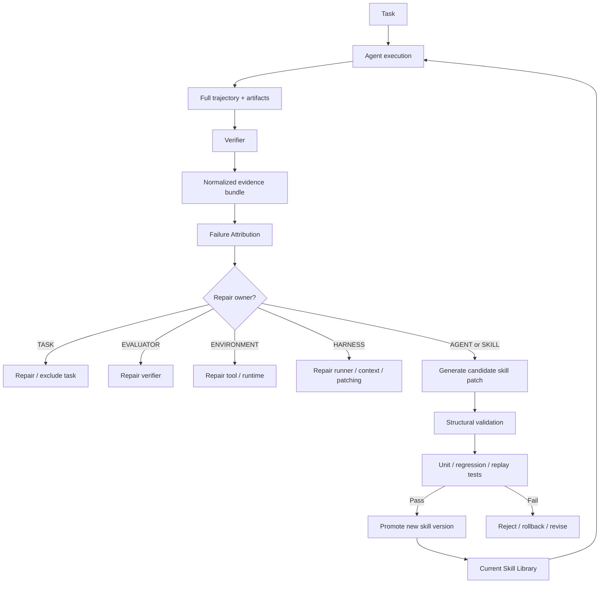

# SkillFlow 错误归因与自学习 Workflow 诊断研究

## 执行摘要

我检查了 `ZhangZi-a/SkillFlow` 的 README、主要 runner、skill evolution/patch 代码、analysis 脚本、skill usage 解析逻辑，以及当前公开 Issues / PR；同时对照了 SkillFlow 论文及几类最接近的 agent failure diagnosis / self-improvement 工作，包括 AgentErrorTaxonomy/AgentDebug、AgentRx、MAST、Aegis、MUSE-Autoskill，以及最新的 interaction-centric failure taxonomy。仓库 README 也明确说明：核心代码在 GitHub，而具体 benchmark task data 单独分发，每个任务包预期含 `tests/` 和 `solution/`。fileciteturn5file0L2-L2

**最重要的结论是：SkillFlow 不是“完全没有错误分类”，而是“论文里有初步分类，代码里没有把它变成结构化、可统计、可驱动决策的错误归因层”。**

论文 Appendix D.3 明确列出至少这些 failure modes：

- `Verifier / toolchain incompatibility`
- `Missing recalculation / missing cached formula values`
- `No or Incomplete verification`
- `Premature success declaration`（作为伴随 failure mode 出现）

论文正文还总结了更高层的长期学习失败模式：**fragmented skill growth / skill inflation、错误逻辑被后续任务持续强化、以及“会写 skill 但不会稳定修 skill”的 repair gap**。citeturn25view0turn24view0

但仓库的实际执行链目前是：

> task → trajectory + verifier result → compact → **直接让 LLM 生成 skill patch** → **直接 apply 到共享 skill library** → 下一题

中间没有一个标准化的：

> **“这次到底是谁错了？错在哪一步？根因属于 agent、skill、verifier、task、harness 还是环境？”**

这正是目前最值得补的一层。`TrialOutcome` 目前主要保留 pass/reward、exception、failed test names、压缩 trajectory 和 final message；skill evolution prompt 虽然要求 LLM 去判断错误策略、missing knowledge、failed tests、dead ends 等，但最终要求的结构化输出只有 `summary / upsert_files / delete_paths`，**没有 `failure_type`、`root_cause_step`、`repair_owner` 或置信度字段**。fileciteturn9file0L2-L2 fileciteturn10file0L2-L2

我认为这会产生一个很实际的问题：

> **SkillFlow 当前把“诊断”和“治疗”揉在了一次自由文本 LLM patch 生成里。**

于是 verifier 自己坏了，也可能学进 skill；任务本身有歧义，也可能学进 skill；环境偶发故障，也可能学进 skill；trajectory 被 compact 丢掉真正根因时，patcher 仍然会给出一个看似合理的修复。恰好 SkillFlow 论文自己已经发现：一个早期错误 skill 会造成 sequence-level downstream drift。citeturn24view0

因此，我建议不要简单再加一串十几个扁平标签，而应做成一个**“归责对象 × 具体原因 × 关键步骤”三层 schema**：

**归责对象：**
`TASK / AGENT / SKILL / HARNESS / EVALUATOR / ENVIRONMENT`

**核心原因：**
`TASK_UNDERSPEC`、`INTENT_PLAN`、`KNOWLEDGE_REASONING`、`TOOL_ACTION`、`STATE_INTERPRETATION`、`VERIFY_TERMINATE`、`OUTPUT_GROUNDING`、`SKILL_RETRIEVAL`、`SKILL_CONTENT`、`SKILL_ORGANIZATION`、`SKILL_REPAIR_TRANSFER`、`HARNESS_CONTEXT_PATCH`、`EVAL_MISMATCH_BUG`、`ENV_RUNTIME_RESOURCE`

然后为每次失败找出**第一个不可恢复的 critical failure step**，而不是只看最后一个 failed test。这一点与 AgentRx、AgentDebug、Aegis 的经验高度一致。AgentRx 明确把每条失败 trajectory 标成 critical step + 9 类 root cause；AgentDebug 更进一步要求找到最小 root-cause failure 集合，而不是把所有下游症状都当根因。citeturn14view0turn22view2

---

## SkillFlow 仓库目前到底在评什么

### 当前代码中的评估链

SkillFlow README 给出的定位是 lifelong skill discovery/evolution benchmark：同一 family 内任务串行执行，共享 skill library 随每个 task 更新；仓库中和本问题直接相关的文件主要是：

| 路径 | 当前职责 | 与错误归因的关系 |
|---|---|---|
| `iterative_shared_skills_runner.py` | 顺序执行 task、读取 verifier、触发 patch、应用 patch | 决定“什么时候认为失败、什么时候进化 skill” |
| `libs/skill_evolution/patcher.py` | compact trajectory、构造 TrialOutcome、调用 LLM 生成 patch、apply patch | 实际的“从失败中学习”核心 |
| `analysis/analyze_iteration_results.py` | completion、reward、exception、token/cost、skill count/usage 汇总 | 目前没有 root-cause breakdown |
| `analysis/skill_usage_parser.py` | 检测 Skill tool / skill 文件实际使用 | 只能说明“用了”，不能说明“帮了还是害了” |
| `analysis/plot_skill_gain_heatmap*.py` 等 | skill gain 可视化 | 结果层分析 |
| 外部 task package 的 `tests/` | verifier/task correctness | README 指向外部分发的 task data，而非本 repo 内统一管理 |

仓库结构和任务分发方式可由 README 与公开 tree 直接确认。fileciteturn5file0L2-L2 fileciteturn2file0L2-L2

runner 在 trial 结束后会读取 `result.json` 和 `verifier/ctrf.json`，取 verifier reward，生成 `verifier_passed`，之后让 trajectory compactor 形成 `TrialOutcome`，再 snapshot 当前 skill library、调用 skill evolver、apply patch，并保存 `outcome.json`、`patch.json`、`applied.json`、`changes.json` / diff 以及 `skill_patch_history.jsonl`。fileciteturn8file0L2-L2

这套日志设计其实已经提供了做错误归因所需的大部分“骨架”；缺的是一层标准化 diagnosis。

### 当前真正传给 skill evolver 的错误证据偏薄

`TrialOutcome` 的结构包含：

```text
trial_name
task_name
task_source
verifier_passed
reward
exception_type
exception_message
failed_test_names
compacted_trajectory
final_agent_message
```

这意味着 verifier 的结构化反馈在传给 patch LLM 时，显式保留下来的主要是 **reward / pass / exception / failed test names**。虽然某些 verifier 细节可能碰巧出现在 trajectory 里，但 schema 本身没有保存 `expected`、`actual`、assertion message、grader stderr、失败 rubric item、失败 artifact state 等证据。fileciteturn9file0L2-L2 fileciteturn16file0L2-L2

这与论文 Appendix D.3 的真实案例恰好形成反差。例如论文区分：

> workbook 本身的问题、没有重新计算的问题、agent 没验证的问题，以及 verifier 调用了环境不支持的 `ssconvert --recalculate` 的问题。

这些分类必须看 **expected/actual 和 verifier/tool stderr** 才容易正确归因，而只给一个 failed-test 名称远远不够。论文最后一页的三个示例对此非常直观。citeturn25view0

### 当前 `error_count` 有一个很容易误读的语义问题

`analysis/analyze_iteration_results.py` 中：

- `reward >= 1.0` 才计入 `completed_tasks`；
- 但是 `error_count` **只在 `exception_type` 非空时增加**。fileciteturn11file0L2-L2

所以假设有：

```text
100 tasks
70 success
28 verifier failed but no Python/agent exception
2 runtime exceptions
```

当前 summary 很可能表现为：

```text
completed_tasks = 70
error_count = 2
```

而不是 30。

代码本身并没有算错它所定义的量，但 **`error_count` 这个名字很危险**：它实际更接近 `exception_count`，不是“任务失败数量”。

建议至少拆成：

```text
failed_task_count
verifier_failure_count
exception_count
attributed_failure_count
unattributed_failure_count
```

否则后续做 workflow diagnosis 时，很容易把 “agent 没通过 verifier” 和 “系统抛异常” 混为一谈。

### reward 的读取也存在一个潜在兼容风险

runner 是从 verifier rewards 字典里取一个 reward 来决定是否通过。只要 benchmark 始终只有单一、0/1 式 reward，这没问题；但若之后出现多个 reward component、partial reward 或不同 scale，那么“第一个值 + `>=1.0`”并不是一个足够明确的评估协议。fileciteturn8file0L2-L2

因此建议在任务 schema 中明确指定：

```json
{
  "primary_reward_key": "task_success",
  "pass_threshold": 1.0
}
```

而不是依赖 rewards 的容器顺序。

### Skill usage 目前是“调用统计”，不是“贡献归因”

`analysis/skill_usage_parser.py` 做得比较扎实的一点，是它不靠字符串猜测，而是解析真实 Skill tool 调用或 skill 文件读取，由此统计 `skill_use_steps`、`skill_use_calls` 和 `skills_used`。fileciteturn17file0L2-L2

但它回答的是：

> **“这个 task 有没有使用 skill？”**

不是：

> **“这个 task 失败是不是 skill 导致的？”**  
> **“没有这个 skill，本来会不会成功？”**  
> **“这个 skill 对结果是正贡献、零贡献还是负贡献？”**

而 SkillFlow 论文已经显示这两个概念差异很大：高 skill usage 不等于高 utility，而且错误 skill 可以造成负迁移。citeturn23academia12turn24view0

因此之后最好新增：

```text
skill_used
skill_causal_role = beneficial | harmful | neutral | unknown
responsible_skill_names
responsible_skill_version
```

而不是继续把 usage rate 当作 skill quality 的 proxy。

---

## SkillFlow 已经有错误分类，但没有真正落进 Workflow

### 论文已有的 task-level 分类

SkillFlow 论文 Appendix D.3 的标题就是 **“Failure Taxonomy Examples”**，并给出三个完整示例。citeturn25view0

| 论文类别 | 含义 | 我建议映射 |
|---|---|---|
| `Verifier / toolchain incompatibility` | verifier 依赖的命令/版本与环境不兼容 | `EVALUATOR / EVAL_MISMATCH_BUG` 或 `ENVIRONMENT / ENV_RUNTIME_RESOURCE` |
| `Missing recalculation / missing cached formula values` | XLSX 中公式写入了，但 verifier 读取 cached result 得到 `None` | 根据根因可能是 `SKILL_CONTENT`、`STATE_INTERPRETATION` 或 `VERIFY_TERMINATE` |
| `No or Incomplete verification` | agent 没实际验证自己认为正确的 artifact | `AGENT / VERIFY_TERMINATE` |
| `Premature success declaration` | 在没有足够成功证据前宣布完成 | `AGENT / VERIFY_TERMINATE` 的 detail |

特别值得注意：这些标签本身就已经说明**不能把所有 verifier failure 都归到 agent/skill**。第一个例子甚至可能主要是 grader/toolchain 的问题。citeturn25view0

### 论文还有 library-level failure modes

SkillFlow 在正文总结了另一层更重要的 lifelong-learning 问题：

**Fragmented skill growth / skill inflation。** 弱一些的模型倾向于不断生成重叠、过窄的 task-specific skills，而不是把经验合并成少量稳定、可复用流程。citeturn24view0

**Reinforcement of erroneous logic / downstream drift。** 早期 skill 中的错误逻辑不是局部错误；因为共享 library 会向后传递，它会成为后续任务的 prior，导致 sequence-level negative transfer。citeturn24view0

**Repair gap。** 强模型和弱模型的差距不只是“能不能写 skill”，而更在于失败后能否真正定位错误并修复已有 skill，而不是继续添加新的 workaround。citeturn24view0

所以 SkillFlow 实际上需要**两层 taxonomy**：

```text
task-run failure
    ↓
为什么这一题失败？

skill-evolution failure
    ↓
为什么这次学习没有改善，甚至伤害下一题？
```

这两层不应该混在一起。

### 代码没有把论文分类持久化

当前 patcher 的 system prompt 确实要求 evolver：

- 找出 reasoning/strategy 哪里错误、不完整或脆弱；
- 将 repeated failures、failed tests、verifier mismatch、dead-end tool choices 当信号；
- 失败时提取 missing knowledge、validation steps、troubleshooting；
- 写 explicit anti-pattern / fallback / decision rule。fileciteturn10file0L2-L2

这其实已经很接近“错误分析器”。

但问题在于，分析之后要求 LLM 输出：

```json
{
  "summary": "...",
  "upsert_files": {...},
  "delete_paths": [...]
}
```

没有：

```json
{
  "failure_owner": "...",
  "failure_type": "...",
  "critical_step": 17,
  "evidence": [...],
  "responsible_skill": "...",
  "confidence": 0.86,
  "should_patch_skill": true
}
```

因此一旦 patch 生成完成，**“为什么改”这个中间推断就消失了**；你们之后无法统计：

> 到底 35% 是 reasoning error，还是 verifier bug？  
> skill 带来的失败主要来自 retrieval，还是 skill 内容错误？  
> task 5→8 的退化是同一个坏 skill 的 negative transfer，还是 agent 自己每次都推错？  
> 哪种错误 patch 后修复率最高？  
> 哪种错误根本不该 patch skill？

这正是当前 observability 最大的空洞。

### 更严重的是：candidate patch 没有 quality gate 就进入长期记忆

`apply_patch()` 当前基本上是：

```python
target = shared_skills_dir / rel
target.write_text(content)
```

删除同样直接执行。代码没有在 `apply_patch` 阶段看到：

- candidate staging；
- skill unit tests；
- regression tests；
- holdout task；
- “新 skill 是否比旧 skill 好”的 A/B；
- 自动 rollback；
- programmatic SKILL schema validation。fileciteturn16file0L2-L2

换句话说：

> **patch LLM 的一次错误判断，可以直接成为下一题的 persistent state。**

这几乎就是 SkillFlow 论文所观察到“错误 skill 造成 downstream drift”的工程机制之一。论文发现的是现象，而当前代码路径告诉我们它为什么容易发生。citeturn24view0

对照 MUSE-Autoskill，这一点尤其明显。MUSE 把 skill creation → evaluation → register 做成 gate：新 skill 先运行自身 unit tests，失败则 patch 后重测，**全部通过才进入 Skill Bank**；已存在 skill 出现错误则 refine，同时会 merge 重叠 skills、prune 持续失败或长期不用的 skills。citeturn19view1

这不是说 MUSE 一定优于 SkillFlow，因为二者研究目的并不完全相同；但作为 production-style self-learning workflow，**“先诊断、再候选修改、再验证、最后 promotion”明显比“失败→立即修改 persistent memory”更可控。**

还有一个值得顺手修的工程问题：`apply_patch()` 当前把模型生成的相对路径直接拼到 `shared_skills_dir`，没有看到对 absolute path、`..` traversal、目录 containment 的强制检查；而 prompt 中的 skill 目录/frontmatter 规则主要是自然语言约束而不是代码 gate。fileciteturn16file0L2-L2 这既是鲁棒性问题，也可能成为安全问题。

### Issues 和 PR 没有提供额外的错误 taxonomy

截至本次检查，公开 Issues API 返回的只有两条：一条询问 task 对应收集到的 skills 是否会公开，另一条询问 Harbor 版本；没有讨论 failure attribution 或 error taxonomy。fileciteturn14file0L2-L2

公开 PR 列表当前为空。fileciteturn15file0L2-L2

所以目前不能指望从 repo 社区讨论里找到一套隐藏的分类规范；最有价值的原始材料仍是论文 Appendix D.3 和代码本身。

---

## 其他人是怎么给 Agent / 自学习系统错误分类的

我认为最值得 SkillFlow 借鉴的不是某一个 taxonomy 的全部标签，而是几篇工作共同形成的四条方法论：

> **找第一处不可恢复根因，而不是最后一个症状；**  
> **把错误归到可修复的 component；**  
> **允许同一个失败有 primary cause + contributing causes；**  
> **不要看到 reward=0 就默认“模型/skill 错了”。**

### 对比表

| 工作 | 分类方法 | 具体类别 | 对 SkillFlow 最有价值的点 |
|---|---|---|---|
| **SkillFlow** | task-level operational examples + library-level qualitative patterns | verifier/toolchain incompatibility；missing recalculation/cache；incomplete verification；premature success；skill fragmentation；erroneous logic propagation；repair gap | 已经意识到 verifier、agent verification 和 skill evolution 是不同故障面，但尚未结构化进代码。citeturn25view0turn24view0 |
| **AgentErrorTaxonomy / AgentDebug** | 按 agent 内部模块分层，再找 critical root cause | Memory、Reflection、Planning、Action、System 共 17 个细类 | 很适合解释“agent 为什么走错”；尤其适合 SkillFlow trajectory diagnosis。citeturn22view0turn22view3 |
| **AgentRx** | 每条失败轨迹标“第一个不可恢复 critical step + root-cause category” | 9 类：plan adherence、invention、invalid invocation、tool-output misinterpretation、intent-plan misalignment、underspecified intent、unsupported intent、guardrails、system failure | 极适合你们做 `critical_step` 和 evidence-based annotation。citeturn14view0 |
| **MAST** | execution stage + failure mode | 14 类，分 specification/system design、inter-agent misalignment、verification/termination | 强调 verification 不只是 pass/fail，而是独立 failure family。citeturn12view0 |
| **Aegis** | 把 task 分成 subtasks，标第一处失败 subtask | navigation、state awareness、tool-output processing、domain-rule violation、instruction following、resource exhaustion | “先定位哪个 workflow subtask 坏了”非常适合 DAEF。citeturn17view0turn17view1 |
| **Model or Harness?** | interaction edge + fault side | 41 modes；组件包括 owner/model/grader/harness/tool/local env/external env 等 | 最适合解决 SkillFlow 的“到底应该修模型、skill、runner 还是 verifier？”问题。citeturn13view2turn15view2 |
| **MUSE-Autoskill** | 不是错误 taxonomy，而是 skill lifecycle | Creation、Memory、Management、Evaluation、Refinement；test-gated registration | 最值得借鉴的是 patch quality gate，而不是标签本身。citeturn19view1 |

### AgentErrorTaxonomy：最像“agent 自己哪部分出了错”

这项工作分析了超过 500 条失败 trajectory，并最终按五个模块构造 taxonomy。其公开定义非常具体。citeturn21view0turn22view0

**Memory**

- Over-simplification / Incomplete Summary
- Hallucination / False Memory
- Retrieval Failure

**Reflection**

- Progress Misassessment
- Outcome Misinterpretation
- Causal Misattribution
- Hallucination

**Planning**

- Constraint Ignorance
- Impossible Action
- Inefficient Planning

**Action**

- Planning–Action Disconnect
- Format Error
- Parameter Error

**System**

- Step Limit Exhaustion
- Tool Execution Error
- LLM Limit
- Environment Error

这些完整定义都列在论文 Appendix A.2。citeturn22view0turn22view4

它最值得 SkillFlow 借鉴的不是这 17 个名字，而是**root-cause discipline**。作者要求 annotator 找“解释下游错误 cascade 的最小 root-cause 集合”，而不是把后面所有错都标一遍；他们甚至专门讨论了怎样区分 Memory Retrieval Failure 和 Planning Constraint Ignorance。citeturn22view2

这正好解决 SkillFlow 的一个核心问题：

> task 8 最后 workbook 错了，不能直接标“workbook error”；  
> 应当回到第一个导致最终 failure 的 decision：到底是没读 skill、skill 写错、误读 tool output、错误计划，还是 verifier 本身坏了。

### AgentRx：我最推荐直接照搬它的“critical step”思想

AgentRx 的九个 root cause 是：citeturn14view0

| 类别 | 简化定义 |
|---|---|
| Plan Adherence Failure | 没遵守已有 plan / policy / orchestrator constraint |
| Invention of New Information | 引入输入、context、tool output 都不支持的信息 |
| Invalid Invocation | tool call schema / 参数非法 |
| Misinterpretation of Tool Output | 工具返回是对的，但 agent 理解错 |
| Intent–Plan Misalignment | 一开始就误解用户目标/约束 |
| Under-specified User Intent | 信息不足，本来应澄清 |
| Intent Not Supported | 所需能力/工具不存在 |
| Guardrails Triggered | safety / access restriction 阻止执行 |
| System Failure | API/连接/系统级故障 |

更关键的是，AgentRx 不只给 category，还记录**critical failure step 和 supporting evidence**，并把 constraint violations 写进可审计 validation log。citeturn14view0

这对 SkillFlow 尤其重要，因为你们本来就有完整 execution trace。相比让 patch LLM 一步输出“改什么 skill”，更合理的是先输出：

```json
{
  "critical_step": 21,
  "failure_owner": "AGENT",
  "cause": "STATE_INTERPRETATION",
  "evidence": [
    "step 18 tool returned 12 rows",
    "step 21 agent concluded there were 11 rows"
  ]
}
```

再决定怎么修。

### MAST：verification 应该独立成一个错误族

MAST 从 1,642 条 multi-agent execution traces 建立 14 个 failure modes，并用三大类组织。其 taxonomy 经过人工迭代标注，最终 human inter-annotator agreement 达到 κ=0.88；few-shot LLM annotator 与人工标注的 κ 达到 0.77。citeturn12view0

其三大类中对 SkillFlow 最关键的是第三类：

- Premature Termination
- No or Incomplete Verification
- Incorrect Verification

作者明确指出，存在 verifier 并不自动代表验证充分；例如只检查 code compilation、却没有验证真正 task objective，也会导致错误成功判断。citeturn12view0

这与 SkillFlow 的 Appendix D.3 几乎直接吻合。citeturn25view0

所以我不建议把“premature success”放到 generic reasoning error 下。它值得形成一个独立的：

```text
AGENT / VERIFY_TERMINATE
```

因为对应的解决措施非常明确：**改变终止条件与验证 policy，而不是让模型“多想一点”。**

### Aegis：错误最好映射到 DAEF 的具体 subtask

Aegis 的设计特别适合 SkillFlow，因为它不满足于给整条 trajectory 一个模糊 label，而是先把任务拆成 subtasks，然后寻找**第一个 unsuccessful subtask**；那些后来被 agent 自己纠正、且没有影响最终结果的临时错误不算 root failure。citeturn16view0turn17view0

它最终得到六类：

```text
Exploration
  State-space Navigation Failure
  State Awareness Failure

Exploitation
  Tool Output Processing Failure
  Domain Rule Violation
  User Instruction Following Failure

Resource
  Resource Exhaustion
```

citeturn17view0turn17view1

对 SkillFlow 来说，可以直接把这个思想和 DAEF 结合：

```text
DAEF node:
READ → EXTRACT → RETRIEVE → UPDATE → VALIDATE → OUTPUT
                 ↑
           critical failure node
```

这样之后你们能回答的就不只是：

> spreadsheet family 失败率 31%

而是：

> spreadsheet family 的失败中，  
> 7% 出在 READ，  
> 11% 出在 RETRIEVE，  
> 39% 出在 UPDATE，  
> 34% 出在 VALIDATE，  
> 9% 出在 OUTPUT。

这才真正能告诉你们 **workflow 哪一步坏了**。

### Model or Harness：不要再默认“失败就是模型错”

这是我认为对 SkillFlow 第二重要的参考工作。

这项 2026 年工作直接提出所谓 **repair-assignment problem**：

> 表面上完全相同的 task failure，实际可能应该修 model、harness、environment 或 grader；仅靠 outcome-level label 会把修复工作分给错误的组件。

它因此将 agent system 划成 model、owner、grader、harness、tool、local environment、external environment 等组件，并把 41 种 failure mode 放到**组件交互的 edge + fault side** 上。citeturn13view2turn15view3

一些特别贴近 SkillFlow 的例子包括：

- **Instruction–Grader Mismatch**：instruction 合理，但 grader 用另一套隐藏预期评分；
- **Reasoning Failure**；
- **Domain Knowledge Deficit**；
- **Satisficing**：没做完、没验证却主动宣布完成；
- **Specification Gaming**；
- **Service Failure**；
- **Stale State Delivery**。citeturn15view4

这解释了为什么 SkillFlow 不能只建立：

```text
misunderstanding
reasoning error
tool error
```

这样的 agent-centric taxonomy。

你们需要一个第一字段：

```text
repair_owner
```

因为**分类的最终目的是告诉工程师应该改哪里**。

---

## 推荐给 SkillFlow 的错误归因体系

### 不建议直接使用一个扁平的二十分类

用户提到的这些类别：

> misunderstanding、knowledge gap、reasoning error、hallucination、prompt/formatting issue、execution/runtime error、data mismatch、ambiguous question、evaluation metric mismatch、annotation error、tooling bug……

它们都应该保留，但如果全部塞在同一层会有一个问题：

```text
hallucination          ← 行为类型
ambiguous question     ← task 本身的问题
runtime error          ← environment 问题
metric mismatch        ← evaluator 问题
skill fragmentation    ← persistent memory 管理问题
```

这些维度不是平级的。

因此我建议采用 **三层标注**：

```text
failure_owner
    ↓
cause_code
    ↓
cause_detail
```

再另外保存：

```text
critical_step
critical_daef_node
evidence
responsible_skill
confidence
```

### 推荐的一级归责对象

| `failure_owner` | 什么时候用 | 默认应该改什么 |
|---|---|---|
| `TASK` | 题目缺信息、矛盾、不可解、ground truth/data 有问题 | benchmark task |
| `AGENT` | 信息充分、工具正常、skill 也没误导，但 agent 理解/推理/行动/验证错 | prompt/model/agent policy |
| `SKILL` | 错误来自已加载的 persistent skill，或 skill 管理/修复导致负迁移 | skill library |
| `HARNESS` | trajectory/context/skill injection/patching/orchestration 机制损坏信息或行为 | runner/scaffolding |
| `EVALUATOR` | grader/verifier/metric/annotation 与真实目标不一致或自身有 bug | verifier |
| `ENVIRONMENT` | API、binary、network、runtime、resource limit、外部依赖导致失败 | container/tool/env |

这个层级基本融合了 AgentRx 的 user/system 区分、AgentErrorTaxonomy 的 module diagnosis、SkillFlow 自己的 verifier examples，以及 interaction-centric taxonomy 的 repair assignment 原则。citeturn14view0turn22view0turn25view0turn15view3

### 推荐的二级原因

| Code | 中文定义 | 典型现象 | 对应已有研究 |
|---|---|---|---|
| `TASK_UNDERSPEC` | 任务缺失、歧义、矛盾或必要数据不存在 | agent 必须凭空猜 owner-only decision | AgentRx under-specified intent；Instruction-Grader mismatch。citeturn14view0turn15view4 |
| `INTENT_PLAN` | 误解目标/约束或形成错误计划 | 做的是另一件“合理的事” | AgentRx intent-plan；MAST specification failure。citeturn14view0turn12view0 |
| `KNOWLEDGE_REASONING` | 缺知识、计算、逻辑、规则应用错误 | 信息都在，但推错 | AgentErrorTaxonomy planning；Aegis tool-output processing/domain rules。citeturn22view0turn17view1 |
| `TOOL_ACTION` | 工具选错、调用格式或参数错、plan/action 脱节 | malformed invocation、错 path/cell/API | AgentRx invalid invocation；AgentErrorTaxonomy action。citeturn14view0turn22view4 |
| `STATE_INTERPRETATION` | tool output、artifact state 或环境状态读错 | tool 返回 12，agent 记成 11 | AgentRx misinterpretation；Aegis state awareness。citeturn14view0turn17view0 |
| `VERIFY_TERMINATE` | 没验证、验证不足、错误验证、过早宣布完成 | “saved successfully” 后直接结束 | SkillFlow D.3；MAST FC3。citeturn25view0turn12view0 |
| `OUTPUT_GROUNDING` | 最终格式/contract 不符或生成 unsupported information | wrong JSON/schema、hallucinated value | AgentRx invention；AgentErrorTaxonomy format/hallucination。citeturn14view0turn22view0 |
| `SKILL_RETRIEVAL` | 有正确 skill 但没取到、取错 skill 或错误触发 | 相关 skill 存在但未使用 | 可借鉴 Memory Retrieval Failure。citeturn22view0 |
| `SKILL_CONTENT` | 使用了 skill，但 skill 内 procedure/code/assumption 本身错误 | 同一错误跨后续任务重复 | SkillFlow erroneous logic/downstream drift。citeturn24view0 |
| `SKILL_ORGANIZATION` | 重复、过窄、互相冲突、skill inflation | 每道题新建一个近似 skill | SkillFlow fragmented growth；MUSE merging/pruning。citeturn24view0turn19view1 |
| `SKILL_REPAIR_TRANSFER` | 知道失败却修错，或新 patch 对后续任务产生 negative transfer | task t patch 后 t+1…t+n 下降 | SkillFlow repair gap。citeturn24view0 |
| `HARNESS_CONTEXT_PATCH` | compaction、skill injection、runner、patch parser/apply 导致关键信息损失或错误状态 | critical step 被压缩掉；错误 patch 无 gate 写入 | interaction-centric harness principle；当前 SkillFlow patch path。citeturn15view3 fileciteturn16file0L2-L2 |
| `EVAL_MISMATCH_BUG` | verifier/toolchain/metric/annotation 与 task objective 不一致 | 正确 artifact 被错判、grader command 本身坏 | SkillFlow verifier mismatch；Instruction-Grader Mismatch。citeturn25view0turn15view4 |
| `ENV_RUNTIME_RESOURCE` | API/依赖/网络/容器/step-token budget 出问题 | timeout、rate limit、binary missing | AgentRx system failure；Aegis resource exhaustion。citeturn14view0turn17view1 |

你特别提到的标签可以放进 `cause_detail`：

```text
misunderstanding       → INTENT_PLAN
knowledge_gap          → KNOWLEDGE_REASONING
reasoning_error        → KNOWLEDGE_REASONING
hallucination          → OUTPUT_GROUNDING
prompt_format_error    → TOOL_ACTION / OUTPUT_GROUNDING
execution_error        → TOOL_ACTION or ENV_RUNTIME_RESOURCE
data_mismatch          → STATE_INTERPRETATION / TASK_UNDERSPEC
ambiguous_question     → TASK_UNDERSPEC
metric_mismatch        → EVAL_MISMATCH_BUG
annotation_error       → EVAL_MISMATCH_BUG
tooling_bug            → ENV_RUNTIME_RESOURCE / HARNESS_CONTEXT_PATCH
```

### 最重要的 decision rule：找“第一个不可恢复错误”

建议采用 AgentRx + AgentDebug/Aegis 的思路：

> **不要标最后一个出错步骤。标最早的、如果修正它就很可能改变最终 outcome 的 critical failure。**

AgentRx 将 root cause 定义为 critical failure step；AgentDebug 人工标注时先记录所有 failure，再从 terminal failure 倒推到最早不可恢复 failure，并强调 root-cause set 而非下游表面错误。citeturn14view0turn22view2

例如：

```text
step 7   agent 误读了 workbook sheet
step 10  因而选了错误 cell
step 14  写入错误位置
step 18  validation 失败
step 19  agent 宣布成功
```

不应该把 primary cause 标成：

```text
VERIFY_TERMINATE
```

而应该是：

```text
primary:
  STATE_INTERPRETATION @ step 7

contributing:
  TOOL_ACTION @ step 14
  VERIFY_TERMINATE @ step 19
```

这样真正可修。

### 再加一个 counterfactual repair-owner test

分类时按以下顺序问：

```text
如果 verifier 修了，输出会被判对吗？
    YES → EVALUATOR

如果环境/工具恢复正常，原计划会成功吗？
    YES → ENVIRONMENT

如果补足 task 的缺失信息，agent 原行为才有唯一正确答案吗？
    YES → TASK

如果保留 agent/model，但去掉/换回旧 skill，问题会消失吗？
    YES → SKILL

如果保留所有输入和 skill，只修某个 agent decision 就能成功吗？
    YES → AGENT

如果真正根因是 context injection / compaction / patching / orchestration？
    YES → HARNESS
```

这就是把 interaction-centric taxonomy 的“fault side”思想真正工程化。citeturn13view2turn15view3

### 推荐的数据结构

```json
{
  "task_name": "weighted-hospital-bedflow-calc",
  "passed": false,

  "failure_attribution": {
    "primary": {
      "owner": "SKILL",
      "cause": "SKILL_CONTENT",
      "detail": "missing_cached_formula_recalculation",
      "critical_step": 23,
      "critical_daef_node": "VALIDATE",
      "responsible_skill": "excel-formula-update",
      "skill_version": "sha256:...",
      "confidence": 0.91
    },

    "contributing": [
      {
        "owner": "AGENT",
        "cause": "VERIFY_TERMINATE",
        "detail": "premature_success"
      }
    ],

    "evidence": [
      {
        "source": "trajectory",
        "step": 23,
        "text": "formulas written; workbook saved"
      },
      {
        "source": "verifier",
        "test": "H12",
        "expected": 612.5,
        "actual": null
      }
    ],

    "should_patch_skill": true,
    "repair_target": "excel-formula-update",
    "diagnosis_status": "attributed"
  }
}
```

重要的是：**diagnosis JSON 和 skill patch JSON 分开。**



这张图与当前 SkillFlow 最大的区别只有两层，却非常关键：

> **Failure Attribution**  
> **Candidate Patch Validation**

---

## 怎么在现有仓库里落地

### 先做最小版本，不要一开始就建一个复杂 classifier

我建议第一版只做：

```text
6 个 owner
14 个 cause
1 个 critical_step
1 个 critical_daef_node
primary + secondary
evidence
confidence
should_patch_skill
```

先拿 100–200 条失败 trajectory 做人工校准。

AgentErrorTaxonomy 本身也是通过 open coding、pilot annotation 和 disagreement adjudication 不断修类别边界；AgentRx 也是从真实失败 trajectory 中用 grounded-theory 式方法形成 taxonomy，而不是凭空设计一个漂亮的分类表。citeturn21view0turn14view0

### 在 `TrialOutcome` 中保存完整 verifier evidence

现在显式字段太少。建议扩成：

```python
@dataclass
class TrialOutcome:
    ...
    verifier_passed: bool
    reward: float

    failed_test_names: list[str]
    verifier_failures: list[VerifierFailure]
    verifier_stdout: str | None
    verifier_stderr: str | None
    rubric_failures: list[str]

    exception_type: str | None
    exception_message: str | None

    compacted_trajectory: list[dict]
    final_agent_message: str
```

至少每个失败 test 保存：

```json
{
  "name": "...",
  "status": "failed",
  "message": "...",
  "expected": "...",
  "actual": "...",
  "stdout": "...",
  "stderr": "..."
}
```

否则论文 D.3 那类 `expected X got None` 和 `ssconvert unknown option` 根本不容易自动区分。citeturn25view0

### 不要让 trajectory compactor 把根因证据裁掉

当前 patching 流程会 compact trajectory 后再交给 evolver。fileciteturn9file0L2-L2

对于普通“总结这次做了什么”没问题；但对于 root-cause attribution，一个很常见的错误模式是：

```text
前面发生关键错误
↓
中间几十步错误传播
↓
最后 failed verifier
```

AgentDebug 的研究恰恰发现 early/mid trajectory error 会逐步传播，尤其 memory/reflection 类错误容易造成 cascade。citeturn22view3

因此 compact 策略应该从：

```text
first few + last few
```

升级为：

```text
first steps
+ anomalous/tool-error steps
+ steps referenced by failed verifier evidence
+ first suspected divergence
+ final steps
```

即 **failure-aware compaction**。

### 把 diagnosis 与 patch 分成两次模型调用

建议：

**第一次：diagnostic annotator**

严格输出 schema：

```json
{
  "primary_owner": "...",
  "primary_cause": "...",
  "critical_step": 0,
  "critical_daef_node": "...",
  "responsible_skill": null,
  "evidence_step_ids": [],
  "contributing_causes": [],
  "confidence": 0.0,
  "should_patch_skill": false,
  "reason": "..."
}
```

**第二次：skill evolver**

只拿：

```text
diagnosis
+ supporting evidence
+ relevant skill files
+ failed verifier details
```

生成 patch。

这样你甚至可以对 diagnosis 本身做 accuracy benchmark，这与 AgentRx 和 AgentDebug 的 step/category accuracy 思路一致。AgentRx 分别评估 step localization 与 failure-category accuracy；AgentDebug进一步有 Step、Step+Module、Step+Module+Error Type 的严格指标。citeturn14view0turn21view0

### 非 `AGENT/SKILL` 根因默认不要修改长期 skill

这是最容易产生收益的一条规则。

建议第一版：

```python
if primary_owner in {
    "TASK",
    "EVALUATOR",
    "ENVIRONMENT",
    "HARNESS",
}:
    patch_policy = "NO_PERSISTENT_SKILL_PATCH"
```

特殊情况下可以写“环境兼容 troubleshooting skill”，但应该要求有额外证据，而不是默认。

否则：

```text
verifier bug
↓
agent 从 bug 中总结经验
↓
skill 教未来 agent 如何迎合这个 bug
↓
bug 被 benchmark 修复
↓
旧 skill 反而永久变错
```

这就是典型的 evaluator contamination。

### Skill patch 必须先进入 candidate branch

把当前：

```text
generate
→ apply
→ next task
```

改成：

```text
generate
→ stage
→ validate
→ promote / reject
→ next task
```

MUSE-Autoskill 的 create → evaluate → register gate 就采用类似原则；失败 skill 不直接进入 bank，而是先根据 test error refine，然后重新测试。citeturn19view1

最低限度可以验证：

```text
路径 containment
SKILL.md 存在
YAML frontmatter 只有允许字段
name 与目录一致
description 非空
script syntax
references path 存在
禁止绝对路径 / ..
无重复 skill name
```

进一步再做：

```text
replay current failed task
replay 1–2 个此前该 skill 成功的 tasks
```

得到一个极有价值的指标：

```text
repair_success:
  failed task 0 → 1

regression:
  previous passing task 1 → 0
```

只有：

```text
repair_success == true
and regression == false
```

才 promote。

这会直接针对论文中的 **repair gap** 和 **negative transfer**。citeturn24view0

### 给每个 skill 做版本化，而不是只看最终目录

现在已经有 `changes.diff` 和 history，这是很好的起点。fileciteturn8file0L2-L2

建议每次 patch 再记录：

```json
{
  "skill": "xlsx-recalculation",
  "parent_version": "a83f...",
  "candidate_version": "f927...",
  "trigger_task": "...",
  "trigger_failure_id": "...",
  "patch_reason": "SKILL_CONTENT",
  "validation": {
    "trigger_task_before": 0,
    "trigger_task_after": 1,
    "regression_passed": true
  }
}
```

随后可以真正计算：

```text
Skill repair precision
Skill repair success rate
Negative-transfer rate
Mean downstream delta after patch
Skill survival time
Skill merge rate
Skill fragmentation rate
```

### 修改 analysis 统计，让它能回答“哪里坏了”

`analysis/analyze_iteration_results.py` 现在主要统计 completion、exception、tokens/cost、skill count/use。fileciteturn11file0L2-L2

建议增加：

| 指标 | 回答的问题 |
|---|---|
| `failure_owner_distribution` | 主要是谁的问题？ |
| `failure_cause_distribution` | 具体哪类问题最多？ |
| `failure_by_daef_node` | workflow 哪一步最脆弱？ |
| `critical_step_distribution` | 失败通常发生在早期还是后期？ |
| `skill_induced_failure_rate` | 失败里多少是 skill 导致的？ |
| `skill_retrieval_miss_rate` | skill 有但没取到的比例 |
| `repair_attempt_rate` | 出现 skill failure 后是否真的修了 |
| `repair_success_rate` | 修完当前题是否解决 |
| `negative_transfer_rate` | patch 是否让后续题退化 |
| `fragmentation_rate` | 是否不断新建重复 skill |
| `evaluator_failure_rate` | 有多少“失败”其实不该怪 agent |
| `unattributed_rate` | 分类器自己也无法确定的比例 |

最终 dashboard 才应该长得像：

```text
Family: spreadsheet-grounding

Failures: 31

By owner
  AGENT       12  38.7%
  SKILL        9  29.0%
  EVALUATOR    5  16.1%
  ENVIRONMENT  2   6.5%
  HARNESS      2   6.5%
  TASK         1   3.2%

By DAEF node
  READ         2
  EXTRACT      3
  RETRIEVE     5
  UPDATE       6
  VALIDATE    13  ← main bottleneck
  OUTPUT       2

Skill failures
  wrong content        5
  failed repair        2
  bad retrieval        1
  fragmentation        1
```

这比一个 reward heatmap 对改 workflow 有用得多。

---

## 十个示例标注

下面十个是**按照 SkillFlow 场景构造的示范标注**，不是声称它们全部来自仓库现有 benchmark。前几个刻意贴近论文已有真实 failure modes。SkillFlow Appendix D.3 的实际例子提供了 verifier/toolchain、cached value 和 incomplete verification 三种典型模式。citeturn25view0

| 错误案例 | Primary label | Secondary | 为什么这么标 | 应不应该 patch skill |
|---|---|---|---|---|
| **A. Agent 写好 XLSX formulas，保存后说完成；verifier `data_only` 读到 `None`。** | `SKILL / SKILL_CONTENT`，前提是已用 skill 明确错误地教“写 formula 后直接保存即可” | `AGENT / VERIFY_TERMINATE` | 真正持久错误来自 reusable procedure；agent 又没检查 cached values | **应该**，修 skill，并加验证步骤 |
| **B. Workbook 其实正常，但 verifier 执行 `ssconvert --recalculate`，当前 binary 不支持该 option。** | `EVALUATOR / EVAL_MISMATCH_BUG` | `ENVIRONMENT / ENV_RUNTIME_RESOURCE` | agent artifact 不是主要根因，失败发生在 grader/toolchain | **不应该**默认改 skill |
| **C. Agent 说“所有公式正确”，但从未打开保存后的文件做 independent check。** | `AGENT / VERIFY_TERMINATE` | 无 | 典型 incomplete verification / premature success | **可 patch** validation skill/policy |
| **D. Tool 返回 12 条 records，agent 后面坚持只有 11 条。** | `AGENT / STATE_INTERPRETATION` | `KNOWLEDGE_REASONING` | 原始 tool output 正确，错误发生在 observation interpretation | 只有该错误可复用时才 patch |
| **E. Agent 计划正确，但把目标 sheet `Data_2025` 参数传成 `Data2025`，API 报不存在。** | `AGENT / TOOL_ACTION` | 无 | plan 是对的，具体 invocation/parameter 错 | 通常不必建新 skill；若重复发生可增强 existing skill |
| **F. 任务没有说明金额应该使用 trade date 还是 settlement date，两个答案都合理；agent任选其一然后被 grader 判错。** | `TASK / TASK_UNDERSPEC` | 可能 `EVALUATOR / EVAL_MISMATCH_BUG` | 正确行为应是澄清或 benchmark 补 specification，而不是让 skill 学 hidden convention | **不应该** |
| **G. 第三题学到的 skill 错误规定“任何 XLSX 都用 XML patch cached values”；第五题的 workbook 需要真实 engine recalculation，agent沿用旧规则失败。** | `SKILL / SKILL_CONTENT` | `SKILL_REPAIR_TRANSFER` | 旧 skill 中过度泛化的 procedure 直接造成失败 | **应该**修，并 regression-test 第三题 |
| **H. 每次遇到类似 spreadsheet task 都新建一个 `xlsx-fix-*` skill，后来 retrieval 时选中不合适的变体。** | `SKILL / SKILL_ORGANIZATION` | `SKILL_RETRIEVAL` | 根因不是缺 skill，而是重复/碎片化导致选择困难 | **应该 merge/prune**，不是继续加 skill |
| **I. Agent 输出完全符合 task 文档，但 hidden grader 要求另一种 return type。** | `EVALUATOR / EVAL_MISMATCH_BUG` | `TASK / TASK_UNDERSPEC` | 应修 benchmark contract；interaction-centric taxonomy 的 Instruction–Grader Mismatch 就是这种情况。citeturn15view4 | **不应该** |
| **J. trajectory 有 90 步，真正错误在 step 34；compactor 只保留首尾关键信息，patch LLM 看到最后 validation failure 后误以为是验证流程问题，并写出错误 skill patch。** | `HARNESS / HARNESS_CONTEXT_PATCH` | 后果是 `SKILL / SKILL_REPAIR_TRANSFER` | agent 原始错误与 patcher 看到的 evidence 不一致；学习系统自身的信息压缩改变了归因 | **先修 harness，不应该盲 patch** |

这里最能说明问题的是案例 J。

如果你们现在只观察：

```text
task failed
→ patch generated
→ next task failed
```

很容易得出：

> “模型 self-evolution 能力弱。”

但加上 error attribution 后可能发现：

```text
task failed
→ critical evidence 被 compaction 丢掉
→ diagnosis 错
→ wrong patch 被无验证直接 promote
→ next task negative transfer
```

此时真正应该改的根本不是 model，而是：

```text
HARNESS_CONTEXT_PATCH
+ candidate patch validation
```

这就是为什么“错误分类”对 SkillFlow 不只是一个 analysis feature，而应该进入整个 learning loop。

---

## 最终建议

从仓库和外部工作综合来看，我会把你们当前最值得优先排查的问题按重要性排序为：

**第一优先级：增加独立 Failure Attribution 层。**  
当前 patcher 已经在自然语言里做错误分析，但分析结果没有结构化保存，导致事后无法知道 patch 究竟是在修 agent、skill、verifier 还是环境。AgentRx、AgentDebug 和 interaction-centric taxonomy 都说明，**critical step + root cause + repair owner** 比单纯 outcome 更能指导实际修复。citeturn14view0turn22view3turn15view3

**第二优先级：禁止未验证 patch 直接污染 persistent skill library。**  
SkillFlow 自己的论文已经观察到错误 skill 会造成下游漂移和负迁移，而当前 `apply_patch()` 的实现正是直接把 candidate 内容写入共享目录。citeturn24view0 fileciteturn16file0L2-L2 这里应借鉴 MUSE 的 create/evaluate/register 思路，至少做 staging + replay current task + previous-passing regression。citeturn19view1

**第三优先级：让 verifier evidence 成为 first-class data。**  
不要只给 patcher `failed_test_names`；保存 expected/actual、assertion message、stderr、rubric item、artifact validation evidence。SkillFlow 论文自己的 D.3 taxonomy 已经说明，没有这些信息就很难区分 artifact bug、agent verification failure 与 verifier/toolchain incompatibility。citeturn25view0

**第四优先级：让 error taxonomy 对齐 DAEF。**  
Aegis 的 subtask-level failure localization 很适合 SkillFlow，因为 SkillFlow 的独特资产本来就是 DAEF。最终真正应该分析的是：

```text
failure_owner × cause_type × DAEF_node
```

而不只是 task family × reward。Aegis 的经验表明，相同的“信息获取失败”可能实际来自 navigation、state awareness 或后续 processing，不做 subtask localization 就无法知道哪里该优化。citeturn16view0turn17view0

**第五优先级：重新定义 analysis 中的 `error_count`。**  
目前它实际上只统计 exception，而不是所有 failed tasks，应改名为 `exception_count`，并增加 verifier failure/root-cause distributions。fileciteturn11file0L2-L2

最终，我认为 SkillFlow 最合适的诊断单元不是：

```text
“这道题做错了，属于 reasoning error。”
```

而应该是：

```json
{
  "task": "...",
  "success": false,

  "critical_failure": {
    "step": 34,
    "daef_node": "VALIDATE",
    "owner": "SKILL",
    "cause": "SKILL_CONTENT",
    "detail": "incorrect_recalculation_strategy",
    "skill": "xlsx-formula-repair@v3",
    "confidence": 0.91
  },

  "contributing_failures": [
    {
      "owner": "AGENT",
      "cause": "VERIFY_TERMINATE",
      "detail": "premature_success"
    }
  ],

  "repair": {
    "target": "skill",
    "candidate_patch": "v4",
    "trigger_task_repaired": true,
    "regression_passed": true,
    "promoted": true
  }
}
```

当你们积累一批这样的记录后，就能真正回答最初的问题：

> **“我们的 workflow 问题到底出在哪里？”**

答案会从现在的：

```text
某模型 + skill 后 reward 掉了
```

升级到：

```text
该模型的主要问题不是 skill usage 不足，
而是 VALIDATE 节点上的 VERIFY_TERMINATE；

另一模型的问题不是 reasoning 弱，
而是它生成大量 SKILL_ORGANIZATION / fragmentation；

某一 family 的负迁移不是 agent 本身，
而是早期 SKILL_CONTENT 错误经过未验证 patch 被直接 promotion；

另一些所谓失败甚至不是 agent failure，
而是 EVALUATOR / toolchain mismatch。
```

这才是对 SkillFlow 这类 lifelong self-evolution benchmark 最有价值的错误分类方式，也与目前最成熟的 AgentErrorTaxonomy、AgentRx、MAST、Aegis 与 interaction-centric failure localization 的共同趋势一致：**不只问“有没有错”，而是定位第一处决定性错误、确认谁该负责修、再验证修复是否真的改善后续行为。** citeturn22view0turn14view0turn12view0turn17view0turn13view2